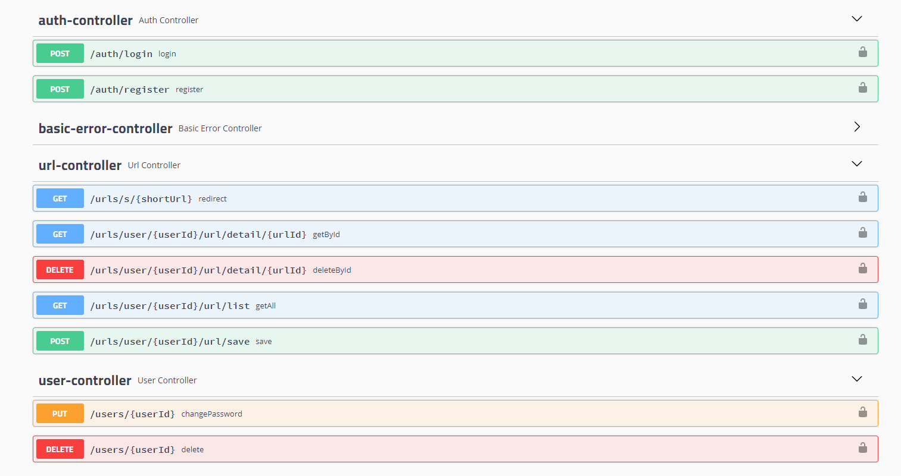

# Shortened Url Project
This project was developed with Spring Boot and React.

Project Status : 


## Used Technologies

- Java 11
- Spring Boot
- Spring Data JPA
- Spring Security
- Swagger documentation
- Lombok
- MySQL database
- H2 database (for **test**)
- ReactJS for frontend
- Maven Frontend Plugin

## Install & Run With Maven

*$PORT: 8080*

```ssh

git clone https://github.com/nejlasahin/spring-shortened-url.git

$ cd spring-shortened-url
$ mvn clean install
$ java -jar target/*.jar

```

## Pull & Run With Docker

*$PORT: 8080*

```ssh

git clone https://github.com/nejlasahin/spring-shortened-url.git

$ cd spring-shortened-url
$ docker-compose up

```

## Swagger UI will be run on this url

`http://localhost:${PORT}/swagger-ui.html`

## API Endpoints

